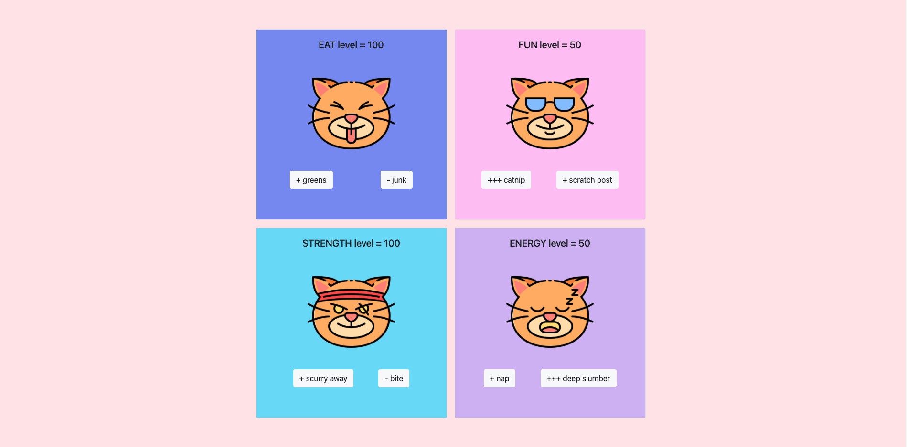

# Tamagotchi

### Overview
Remember Tamagotchis? They were all the rage back in the late 90s/early 2000s. This is an app to relive the good ol' days! Tamagotchi is a keychain-sized virtual pet simulation game. In this app, the user can make the virtual cat eat, play, fight, or sleep. Levels will go up or down, depending on which button the user chooses.
### Deployed project
[Tamagotchi](https://lindseysatterfield-tamagotchi.netlify.app/) 
### Project board
[Tamagotchi Project Board](https://github.com/lindseysatterfield/ASSIGNMENT-Tamagotchi/projects)

### Features
- 4 quadrants for each activity
- User score can only go from 100 to 0
- Each button either add or subtracts different numbers
- Each quadrant's scoring functions and cards were dynamically created and added to the DOM

### Screenshot

### Contributors
[Lindsey Satterfield](https://github.com/lindseysatterfield)

### Video walkthrough
[Loom](https://www.loom.com/share/12b7b4fc12a14c58b8b1dd3853a618d5)
